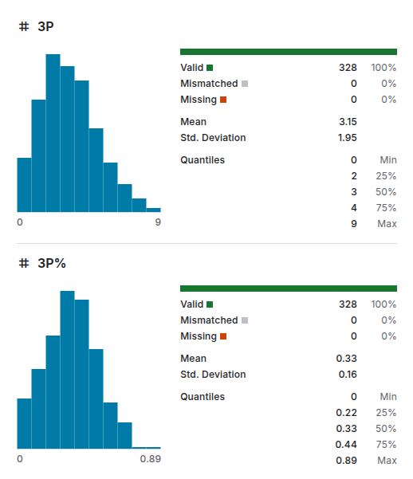

# ICON Project

# 0 - Introduzione

In questo progetto, l'obiettivo è prevedere la **probabilità di vittoria** dei **Dallas Mavericks** in base alla performance di **Luka Dončić**, uno dei giocatori più rilevanti della squadra. Il modello si concentra sull'impatto che Dončić ha sul risultato finale della partita, cercando di determinare quanto il suo contributo individuale possa influenzare la vittoria o la sconfitta della squadra.

Nel progetto in questione si è preso in considerazione un dataset, fornito da [basketball-reference.com](https://www.basketball-reference.com/players/d/doncilu01.html), che contiene al suo interno statistiche sui match della regular season NBA che vanno dal 2019 al 2024 di **Dončić.** Le statistiche, inizialmente separate per season sono state unificate.

## Obiettivo

L'obiettivo principale è costruire un modello predittivo che riesca a determinare la probabilità che la squadra vinca (**WIN = True**) oppure perda (**WIN = False**).

Utilizzerò un testing set contenente solo partite dell’ultima season in possesso ovvero  la 2023-2024.

# 1 - Dataset e Preprocessing

Il dataset come detto prima è fornito da [basketball-reference.com](https://www.basketball-reference.com/players/d/doncilu01.html), unendo i dati delle season 2020-2021, 2021-2022, 2022-2023 e 2024-2025.

Il dataset è composto dalle seguenti features:

| **Campo** | **Descrizione** | **Dominio** |
| --- | --- | --- |
| **Rk** | Numero progressivo della partita nella stagione | Numero intero (≥1) |
| **G** | Numero della partita giocata nella stagione | Numero intero (≥1) |
| **Date** | Data della partita | Formato YYYY-MM-DD |
| **Age** | Età del giocatore il giorno della partita | Formato AA-GGG (anni-giorni) |
| **Tm** | Squadra del giocatore | Codice di tre lettere (es. DAL) |
| **HOME** | Partità giocata in casa/trasferta | {@, null} |
| **Opp** | Squadra avversaria | Codice di tre lettere (es. ATL) |
| **R** | Risultato partita e distacco con l’avversario | W/L (distacco), distacco numero intero |
| **GS** | Partite in cui il giocatore è stato titolare | {1, “Did not dress”, “Inactive”} |
| **MP** | Minuti giocati nella partita | Formato MM:SS (es. 35:24) |
| **FG** | Canestri realizzati su azione | Numero intero (≥0) |
| **FGA** | Tiri tentati su azione | Numero intero (≥0) |
| **FG%** | Percentuale di realizzazione su azione | Numero decimale tra 0 e 1 |
| **3P** | Triple realizzate | Numero intero (≥0) |
| **3PA** | Triple tentate | Numero intero (≥0) |
| **3P%** | Percentuale di realizzazione da tre punti | Numero decimale tra 0 e 1 |
| **FT** | Tiri liberi segnati | Numero intero (≥0) |
| **FTA** | Tiri liberi tentati | Numero intero (≥0) |
| **FT%** | Percentuale di realizzazione ai liberi | Numero decimale tra 0 e 1 |
| **ORB** | Rimbalzi offensivi | Numero intero (≥0) |
| **DRB** | Rimbalzi difensivi | Numero intero (≥0) |
| **TRB** | Totale rimbalzi | Numero intero (≥0) |
| **AST** | Assist distribuiti | Numero intero (≥0) |
| **STL** | Palle rubate | Numero intero (≥0) |
| **BLK** | Tiri stoppati | Numero intero (≥0) |
| **TOV** | Palle perse | Numero intero (≥0) |
| **PF** | Falli personali commessi | Numero intero (≥0) |
| **PTS** | Punti segnati | Numero intero (≥0) |
| **GmSc** | Valutazione dell’impatto del giocatore nella partita data dalla seguente [formula](https://www.basketball-reference.com/about/glossary.html#:~:text=GmSc%20%2D%20Game%20Score%3B%20the%20formula,productivity%20for%20a%20single%20game.)  | Numero decimale (può essere negativo) |
| **+/-** | Differenza di punti della squadra mentre il giocatore era in campo | Numero intero (positivo o negativo) |

> Tutti i domini con il simbolo ‘*’ possono avere il valore “Did not dress” o “Inactive” se il giocatore rispettivamente non è entrato in campo o è sempre stato in panchina.
>

## Preprocessing

Il preprocessing dei dati è una fase con molto valore ai fini di aumentare la qualità del modello, poichè essa è strettamente legata alla qualità dei dati.

Ho deciso di attuare le seguenti modifiche sul dataset:

- **Rimozione esempi inutili allo studio**

  Volendo dimostrare l’impatto di un singolo giocatore sulle partite decido di **eliminare tutti gli esempi che contengono informazioni su una partita che il giocatore non ha giocato**, per l’esattezza ho elimnato 50 esempi

- **Rimozione feature inutili allo studio**
    - **MP**, lo rimuovo poiché il valore non varia di molto
    - **ORB** e **DRB**, possono essere eliminate considerando solamente in **TRB**
    - **Date**, il modello deve essere indipendente dalla data
    - **Rk** e **G**, non influenzano l’outcome
    - **TOV**, influenza molto poco l’outcome, viene eliminata per semplificare il modello
    - **Tm**, Il modello deve studiare le prestazioni di un giocatatore per una singola squadra (nel nostro caso i Dallas Maveriks).
    - **Age**, non influenza la partita considerando anche poche stagioni
    - **GS,** dopo l’eliminazione degli esempi inutili la feature ha solo valori uguali a 1
    - **FG***, sono raccolte nella feature **PTS**
    - **FT*,**  sono raccolte nella feature **PTS**
    - **3PA**, può essere eliminata per semplificare il modello e mantenere le feature **3P** e **3P%** in quanto catturano la precisione del giocatore durante il match. Molti tiri da 3 possono influenzare sul punteggio totale o evidenziare una difesa avversaria blanda.
    - **STL**, influenza molto poco l’outcome, viene eliminata per semplificare il modello
    - **BLK**, influenza molto poco l’outcome, viene eliminata per semplificare il modello
    - **OPP**, poco influente sull’outcome in quanto viene rappresentato da una sola stringa, potrebbe creare overfitting
    - **PF**, poco influente sull’outcome in quanto nella maggior parte dei casi non supera i 3 falli per partita
    - **+/-**, non può essere presa in considerazione in quanto essendo il giocatore presente in campo per la maggior parte del tempo, da un’informazione troppo simile a quella dell’outcome
    - **HOME**, eliminato per semplificare il modello
- **Refactor feature**
    - **R**, presenta, oltre al risultato, la differenza di canestri. Decido di eliminare tale informazioni utilizzando solamente un dominio booleano, la feature viene ridenominata in **WIN**.

## Dataset finale

| **Campo** | **Descrizione** | **Dominio** |
| --- | --- | --- |
| WIN | Risultato partita e distacco con l’avversario | { 0, 1 } |
| **3P** | Triple realizzate | Numero intero (≥0) |
| **3P%** | Percentuale di realizzazione da tre punti | Numero decimale tra 0 e 1 |
| **TRB** | Totale rimbalzi | Numero intero (≥0) |
| **AST** | Assist distribuiti | Numero intero (≥0) |
| **PTS** | Punti segnati | Numero intero (≥0) |
| **GmSc** | Valutazione dell’impatto del giocatore nella partita data dalla seguente [formula](https://www.basketball-reference.com/about/glossary.html#:~:text=GmSc%20%2D%20Game%20Score%3B%20the%20formula,productivity%20for%20a%20single%20game.)  | Numero decimale (può essere negativo) |

Il dataset possiede 7 Feature di cui una Feature Target ovvero **WIN**.

## Risultati

- DISTRIBUZIONI

  

  

  

  


Il dataset è stato sicuramente semplificato:

- sono stati rimossi gli esempi inutili
- non ci sono valori mancanti avendo modificato il dominio delle feature
- la distribuzione molto ampia di feature come date sono state modificate per ottenere informazioni più compatte e distribuite meglio

# 1 - Apprendimento supervisionato

Utilizzo l’apprendimento supervisionato per creare dei modelli predittivi, i modelli utilizzati sono:

- **Decision Tree**
- **Random Forest**
- **Support Vector Machine**
- **Logistic Regression**
- **k-NN**

---

Ho diviso il dataset in due partizioni:

- nella prima ci sono partite che vanno dal 2019 al 2024 e verrà usato solamente per il **training.**
- nella seconda parte ci sono solo le partite del 2024 e verrà usato solamente per il **testing.**

Ho utilizato questa disposizione per ottenere un training test con dati mai visti dal modello che verrà creato.

---

Per ogni modello ho confrontato 3 diversi modi di allenamento:

- Senza Cross Validation
- Con K-fold senza shuffling
- Con K-fold con shuffling

*Per convenienza mostrerò le performance dei modelli allenati con k-fold con shuffling*, in ogni caso tutte le statistiche sono visualizzabili nella folder **documents**.

---

Nei modelli che richiedono parametri è stata utilizzata una **GreadSearch** per trovare i migliori parametri. L’ho utilizzata in quanto il dataset non è molto esteso.

---

Per ogni modello si analizza:

- **Matrice di confusione**

  Mostra il numero di **veri positivi, veri negativi, falsi positivi e falsi negativi**.

  Le metriche seguenti sono calcolate utilizzando le varie classificazioni fatte dalla matrice di confusiione

- **ROC Curve**

  Grafico che rappresenta la relazione tra il **`True Positive Rate`(TPR)** e il **`False Positive Rate` (FPR)** a diverse soglie di decisione. L'area sotto la curva (**AUC-ROC**) indica la capacità del modello di distinguere tra classi.

- **Precision-Recall Curve**

  Mostra il rapporto tra **`precisione`** e **`recall`** all’aumentare degli elementi considerati.

- **F1 Score**

  Si calcola la seguente metrica:

  $$
  F1 = 2 \times \dfrac{Precision \times Recall}{Precision + Recall}
  $$

  Ci permette di combinare sia `recall` che `precision`.

- **Accuracy**

  Proporzione di previsioni corrette rispetto al totale delle osservazioni:

  $$
  Accuracy = \dfrac{\text{Previsioni corrette totali}}{\text{Previsioni effettuate}}
  $$

  Oppure in termini di TP, FP, TN e FN:

  $$
  Accuracy = \dfrac{TP+TN}{TP+TN+FP+FN}
  $$


## Decision Tree

Un albero di decisione è un modello predittivo dove:

- ogni nodo interno rappresenta una condizione su un insieme di variabili
- ogni arco rappresenta il valore di tale condizioni sull’esempio preso in considerazione
- le foglie rappresentano il valore della feature target

Partendo dal training set si cercano le condizioni che separino il set in due insiemi che contengano caratteristiche comuni fino ad arrivare ad insiemi che hanno lo stesso valore nella feature target.

I parametri che vogliono essere confrontati sono i seguenti:

```json
{
  'max_depth': [3, 5],  # Profondità dell'albero
  'min_samples_split': [2, 5],  # Numero minimo di campioni per dividere un nodo
  'min_samples_leaf': [1, 2],  # Numero minimo di campioni in una foglia
  'criterion': ['gini', 'entropy']  # Metodo di split
},
```

### Performance

+ Parametri trovati:

  ```jsx
  { 
    'criterion': 'entropy',
    'max_depth': 3,
    'min_samples_leaf': 1,
    'min_samples_split': 2
  }
  ```

+ Matrice di confusione
  <div style="display: flex; justify-content: center">
    
  </div>

+ ROC
  <div style="display: flex; justify-content: center">
    
  </div>
  
+ Precision-Recall
  <div style="display: flex; justify-content: center">
    
  </div>
  
+ F1
  <div style="display: flex; justify-content: center">
    
  </div>

+ Accuracy

  ``` 0.72```

## Random Forest

Una random forest è un classificatore d'insieme ottenuto tramite l'utilizzo di un numero n di alberi di decisone.

- ogni nodo interno rappresenta una condizione su un insieme di variabili
- ogni arco rappresenta il valore di tale condizioni sull’esempio preso in considerazione
- le foglie rappresentano il valore della feature target

Partendo dal training set si cercano le condizioni che separino il set in due insiemi che contengano caratteristiche comuni fino ad arrivare ad insiemi che hanno lo stesso valore nella feature target.

I parametri che vogliono essere confrontati sono i seguenti:

```json
{
  'max_depth': [3, 5],  # Profondità dell'albero
  'min_samples_split': [2, 5],  # Numero minimo di campioni per dividere un nodo
  'min_samples_leaf': [1, 2],  # Numero minimo di campioni in una foglia
  'criterion': ['gini', 'entropy']  # Metodo di split
},
```

### Performance

+ Parametri trovati:

  ```jsx
  { 
    'criterion': 'entropy',
    'max_depth': 3,
    'min_samples_leaf': 1,
    'min_samples_split': 2
  }
  ```

+ Matrice di confusione
  <div style="display: flex; justify-content: center">
    
  </div>

+ ROC
  <div style="display: flex; justify-content: center">
    
  </div>

+ Precision-Recall
  <div style="display: flex; justify-content: center">
    
  </div>

+ F1
  <div style="display: flex; justify-content: center">
    
  </div>

+ Accuracy

  ``` 0.72```
