# Progetto di ICON

# 0 - Introduzione

In questo progetto, l'obiettivo è prevedere la **probabilità di vittoria** dei **Dallas Mavericks** in base alla performance di **Luka Dončić**, uno dei giocatori più rilevanti della squadra. Il modello si concentra sull'impatto che Dončić ha sul risultato finale della partita, cercando di determinare quanto il suo contributo individuale possa influenzare la vittoria o la sconfitta della squadra.

Nel progetto in questione si è preso in considerazione un dataset, fornito da [basketball-reference.com](https://www.basketball-reference.com/players/d/doncilu01.html), che contiene al suo interno statistiche sui match della regular season NBA che vanno dal 2019 al 2024 di **Dončić.** Le statistiche, inizialmente separate per season sono state unificate.

## Obiettivo

L'obiettivo principale è costruire un modello predittivo che riesca a determinare la probabilità che la squadra vinca (**WIN = True**) oppure perda (**WIN = False**).

Utilizzerò un testing set contenente solo partite dell’ultima season in possesso ovvero  la 2023-2024.

# 1 - Dataset e Preprocessing

Il dataset come detto prima è fornito da [basketball-reference.com](https://www.basketball-reference.com/players/d/doncilu01.html), unendo i dati delle season 2020-2021, 2021-2022, 2022-2023 e 2024-2025.

Il dataset è composto dalle seguenti features:

| **Campo** | **Descrizione** | **Dominio** |
| --- | --- | --- |
| **Rk** | Numero progressivo della partita nella stagione | Numero intero (≥1) |
| **G** | Numero della partita giocata nella stagione | Numero intero (≥1) |
| **Date** | Data della partita | Formato YYYY-MM-DD |
| **Age** | Età del giocatore il giorno della partita | Formato AA-GGG (anni-giorni) |
| **Tm** | Squadra del giocatore | Codice di tre lettere (es. DAL) |
| **HOME** | Partità giocata in casa/trasferta | {@, null} |
| **Opp** | Squadra avversaria | Codice di tre lettere (es. ATL) |
| **R** | Risultato partita e distacco con l’avversario | W/L (distacco), distacco numero intero |
| **GS** | Partite in cui il giocatore è stato titolare | {1, “Did not dress”, “Inactive”} |
| **MP** | Minuti giocati nella partita | Formato MM:SS (es. 35:24) |
| **FG** | Canestri realizzati su azione | Numero intero (≥0) |
| **FGA** | Tiri tentati su azione | Numero intero (≥0) |
| **FG%** | Percentuale di realizzazione su azione | Numero decimale tra 0 e 1 |
| **3P** | Triple realizzate | Numero intero (≥0) |
| **3PA** | Triple tentate | Numero intero (≥0) |
| **3P%** | Percentuale di realizzazione da tre punti | Numero decimale tra 0 e 1 |
| **FT** | Tiri liberi segnati | Numero intero (≥0) |
| **FTA** | Tiri liberi tentati | Numero intero (≥0) |
| **FT%** | Percentuale di realizzazione ai liberi | Numero decimale tra 0 e 1 |
| **ORB** | Rimbalzi offensivi | Numero intero (≥0) |
| **DRB** | Rimbalzi difensivi | Numero intero (≥0) |
| **TRB** | Totale rimbalzi | Numero intero (≥0) |
| **AST** | Assist distribuiti | Numero intero (≥0) |
| **STL** | Palle rubate | Numero intero (≥0) |
| **BLK** | Tiri stoppati | Numero intero (≥0) |
| **TOV** | Palle perse | Numero intero (≥0) |
| **PF** | Falli personali commessi | Numero intero (≥0) |
| **PTS** | Punti segnati | Numero intero (≥0) |
| **GmSc** | Valutazione dell’impatto del giocatore nella partita data dalla seguente [formula](https://www.basketball-reference.com/about/glossary.html#:~:text=GmSc%20%2D%20Game%20Score%3B%20the%20formula,productivity%20for%20a%20single%20game.)  | Numero decimale (può essere negativo) |
| **+/-** | Differenza di punti della squadra mentre il giocatore era in campo | Numero intero (positivo o negativo) |

> Tutti i domini con il simbolo ‘*’ possono avere il valore “Did not dress” o “Inactive” se il giocatore rispettivamente non è entrato in campo o è sempre stato in panchina.
>

## Preprocessing

Il preprocessing dei dati è una fase con molto valore ai fini di aumentare la qualità del modello, poichè essa è strettamente legata alla qualità dei dati.

Ho deciso di attuare le seguenti modifiche sul dataset:

- **Rimozione esempi inutili allo studio**

  Volendo dimostrare l’impatto di un singolo giocatore sulle partite decido di **eliminare tutti gli esempi che contengono informazioni su una partita che il giocatore non ha giocato**, per l’esattezza ho elimnato 50 esempi

- **Rimozione feature inutili allo studio**
  - **MP**, lo rimuovo poiché il valore non varia di molto
  - **ORB** e **DRB**, possono essere eliminate considerando solamente in **TRB**
  - **Date**, il modello deve essere indipendente dalla data
  - **Rk** e **G**, non influenzano l’outcome
  - **TOV**, influenza molto poco l’outcome, viene eliminata per semplificare il modello
  - **Tm**, Il modello deve studiare le prestazioni di un giocatatore per una singola squadra (nel nostro caso i Dallas Maveriks).
  - **Age**, non influenza la partita considerando anche poche stagioni
  - **GS,** dopo l’eliminazione degli esempi inutili la feature ha solo valori uguali a 1
  - **FG***, sono raccolte nella feature **PTS**
  - **FT*,**  sono raccolte nella feature **PTS**
  - **3PA**, può essere eliminata per semplificare il modello e mantenere le feature **3P** e **3P%** in quanto catturano la precisione del giocatore durante il match. Molti tiri da 3 possono influenzare sul punteggio totale o evidenziare una difesa avversaria blanda.
  - **STL**, influenza molto poco l’outcome, viene eliminata per semplificare il modello
  - **BLK**, influenza molto poco l’outcome, viene eliminata per semplificare il modello
  - **OPP**, poco influente sull’outcome in quanto viene rappresentato da una sola stringa, potrebbe creare overfitting
  - **PF**, poco influente sull’outcome in quanto nella maggior parte dei casi non supera i 3 falli per partita
  - **+/-**, non può essere presa in considerazione in quanto essendo il giocatore presente in campo per la maggior parte del tempo, da un’informazione troppo simile a quella dell’outcome
  - **HOME**, eliminato per semplificare il modello
- **Refactor feature**
  - **R**, presenta, oltre al risultato, la differenza di canestri. Decido di eliminare tale informazioni utilizzando solamente un dominio booleano, la feature viene ridenominata in **WIN**.

## Dataset finale

| **Campo** | **Descrizione** | **Dominio** |
| --- | --- | --- |
| WIN | Risultato partita e distacco con l’avversario | { 0, 1 } |
| **3P** | Triple realizzate | Numero intero (≥0) |
| **3P%** | Percentuale di realizzazione da tre punti | Numero decimale tra 0 e 1 |
| **TRB** | Totale rimbalzi | Numero intero (≥0) |
| **AST** | Assist distribuiti | Numero intero (≥0) |
| **PTS** | Punti segnati | Numero intero (≥0) |
| **GmSc** | Valutazione dell’impatto del giocatore nella partita data dalla seguente [formula](https://www.basketball-reference.com/about/glossary.html#:~:text=GmSc%20%2D%20Game%20Score%3B%20the%20formula,productivity%20for%20a%20single%20game.)  | Numero decimale (può essere negativo) |

Il dataset possiede 7 Feature di cui una Feature Target ovvero **WIN**.

## Risultati

- DISTRIBUZIONI

  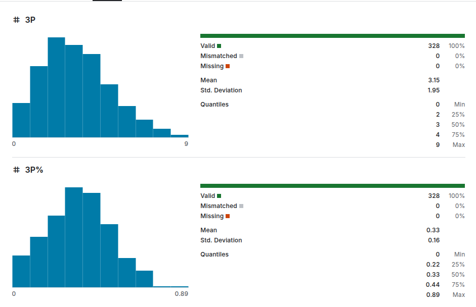
  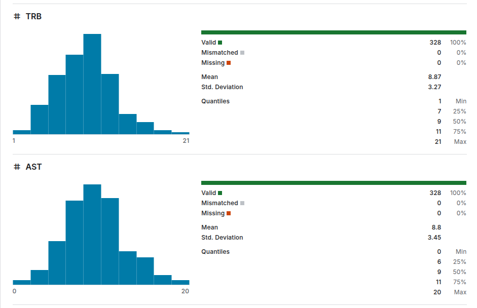
  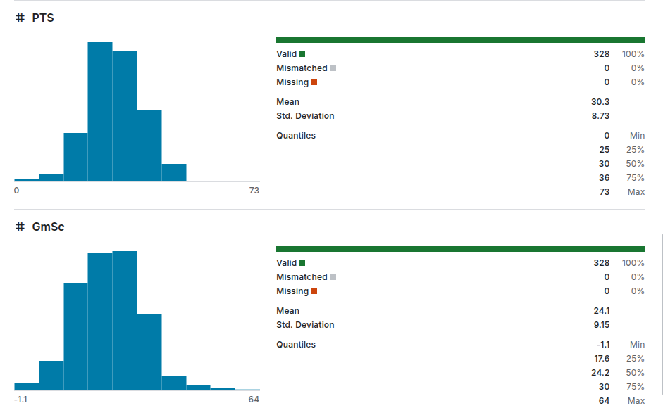
  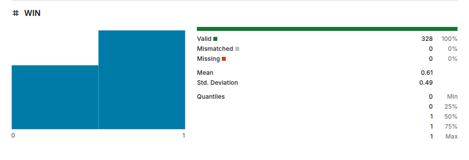

Il dataset è stato sicuramente semplificato:

- sono stati rimossi gli esempi inutili
- non ci sono valori mancanti avendo modificato il dominio delle feature
- la distribuzione molto ampia di feature come date sono state modificate per ottenere informazioni più compatte e distribuite meglio

# 2 - Apprendimento supervisionato

Utilizzo l’apprendimento supervisionato per creare dei modelli predittivi, i modelli utilizzati sono:

- **Decision Tree**
- **Random Forest**
- **Support Vector Machine**
- **Logistic Regression**
- **k-NN**

---

Ho diviso il dataset in due partizioni:

- nella prima ci sono partite che vanno dal 2019 al 2024 e verrà usato solamente per il **training.**
- nella seconda parte ci sono solo le partite del 2024 e verrà usato solamente per il **testing.**

Ho utilizato questa disposizione per ottenere un training test con dati mai visti dal modello che verrà creato.

---

Per ogni modello ho confrontato 3 diversi modi di allenamento:

- Senza Cross Validation
- Con K-fold senza shuffling
- Con K-fold con shuffling

*Per convenienza mostrerò le performance dei modelli allenati con k-fold con shuffling*, in ogni caso tutte le statistiche sono visualizzabili nella folder **documents**.

---

Nei modelli che richiedono parametri è stata utilizzata una **GreadSearch** per trovare i migliori parametri. L’ho utilizzata in quanto il dataset non è molto esteso.

---

Per ogni modello si analizza:

- **Matrice di confusione**

  Mostra il numero di **veri positivi, veri negativi, falsi positivi e falsi negativi**.

  Le metriche seguenti sono calcolate utilizzando le varie classificazioni fatte dalla matrice di confusiione

- **ROC Curve**

  Grafico che rappresenta la relazione tra il **`True Positive Rate`(TPR)** e il **`False Positive Rate` (FPR)** a diverse soglie di decisione. L'area sotto la curva (**AUC-ROC**) indica la capacità del modello di distinguere tra classi.

- **Precision-Recall Curve**

  Mostra il rapporto tra **`precisione`** e **`recall`** all’aumentare degli elementi considerati.

- **F1 Score**

  Si calcola la seguente metrica:

  $$
  F1 = 2 \times \dfrac{Precision \times Recall}{Precision + Recall}
  $$

  Ci permette di combinare sia `recall` che `precision`.

- **Accuracy**

  Proporzione di previsioni corrette rispetto al totale delle osservazioni:

  $$
  Accuracy = \dfrac{\text{Previsioni corrette totali}}{\text{Previsioni effettuate}}
  $$

  Oppure in termini di TP, FP, TN e FN:

  $$
  Accuracy = \dfrac{TP+TN}{TP+TN+FP+FN}
  $$


## Decision Tree

Un albero di decisione è un modello predittivo dove:

- ogni nodo interno rappresenta una condizione su un insieme di variabili
- ogni arco rappresenta il valore di tale condizioni sull’esempio preso in considerazione
- le foglie rappresentano il valore della feature target

Partendo dal training set si cercano le condizioni che separino il set in due insiemi che contengano caratteristiche comuni fino ad arrivare ad insiemi che hanno lo stesso valore nella feature target.

I parametri che vogliono essere confrontati sono i seguenti:

```jsx
{
	'max_depth': [3, 5],  # Profondità dell'albero
	'min_samples_split': [2, 5],  # Numero minimo di campioni per dividere un nodo
	'min_samples_leaf': [1, 2],  # Numero minimo di campioni in una foglia
	'criterion': ['gini', 'entropy']  # Metodo di split
},
```

### Performance

- I parametri migliori trovati sono:

```jsx
{ 
	'criterion': 'entropy',
	'max_depth': 3,
	'min_samples_leaf': 1,
	'min_samples_split': 2
}
```

- Matrice di confusione

  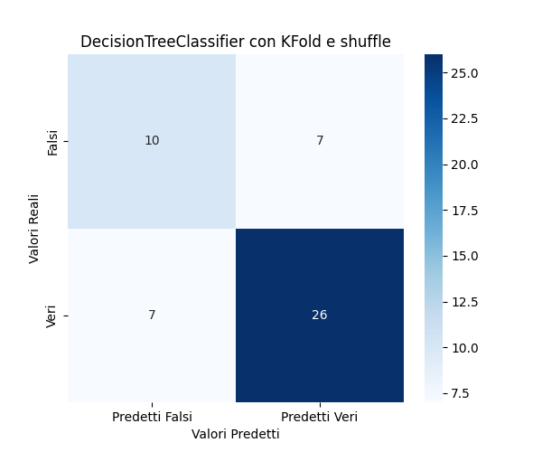

- ROC

  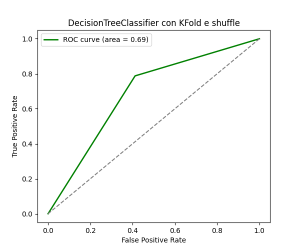

- Precison-Recall

  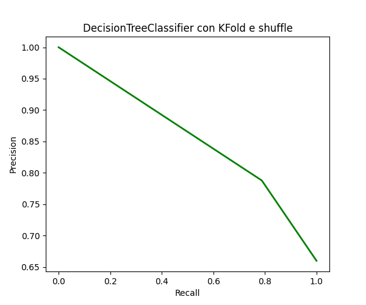

- F1

  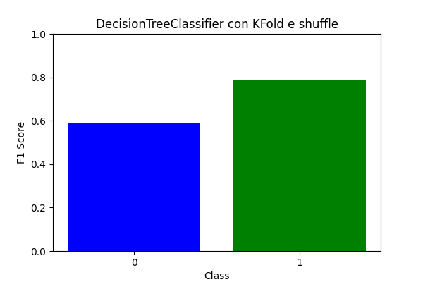

- Accuracy

  `0.72`


## Random Forest

Una random forest è un classificatore d'insieme ottenuto tramite il **bagging** di un numero n di alberi di decisione. Possono risolvere il sovradattamento presente nel singolo albero.

I parametri che vogliono essere confrontati sono i seguenti:

```jsx
{
	'n_estimators': [10, 15, 20], # Numero di alberi
	'max_depth': [10, 20], # Profondità massima degli alberi
	'min_samples_split': [2, 5, 10],  # Minimo campioni per dividere
	'min_samples_leaf': [1, 2, 4]  # Minimo campioni per foglia
}
```

### Performance

- I parametri migliori trovati sono:

```jsx
{
	'max_depth': 10, 
	'min_samples_leaf': 4, 
	'min_samples_split': 10, 
	'n_estimators': 15
}
```

- Matrice di confusione

  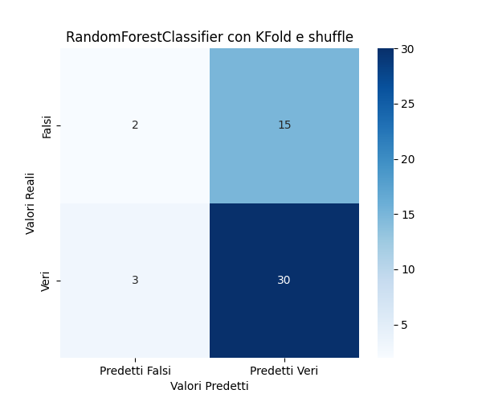

- ROC

  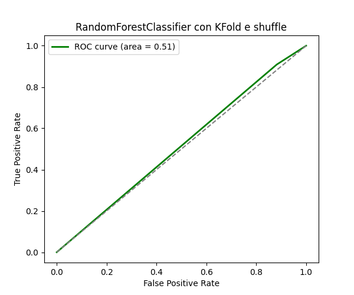

- Precison-Recall

  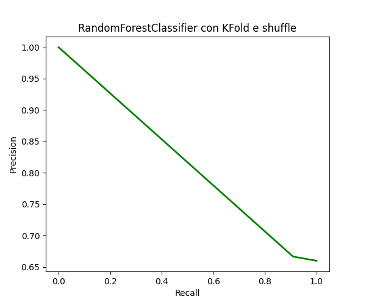

- F1

  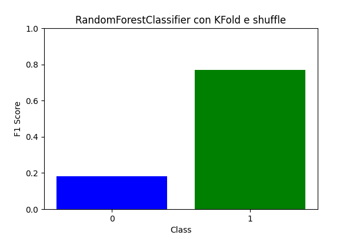

- Accuracy

  `0.64`


## SVC

Il Support Vector Classifier è un algoritmo di **SVM** usato per problemi di classificazione. Trova un **iperpiano ottimale** che separa le classi massimizzando il margine tra i punti di dati più vicini. Per migliorare le performance del modello i dati sono stati normalizzati.

I parametri che vogliono essere confrontati sono i seguenti:

```jsx
{
	'C': [0.1, 1, 10],  # Parametro di penalizzazione
	'kernel': ['linear', 'rbf'],  # Tipo di kernel
	'gamma': ['scale', 'auto', 0.1, 1]  # Parametro per il kernel RBF
}
```

### Performance

- I parametri migliori trovati sono:

```jsx
{
	'C': 1, 
	'gamma': 'scale', 
	'kernel': 'linear'
}
```

- Matrice di confusione

  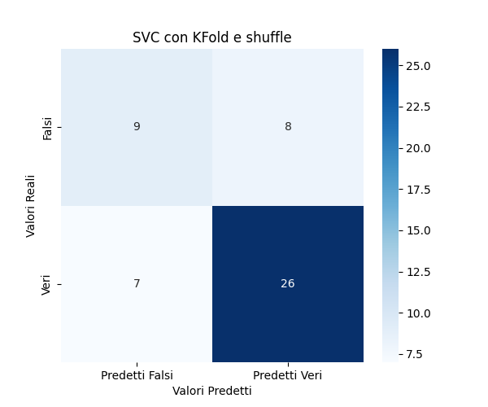

- ROC

  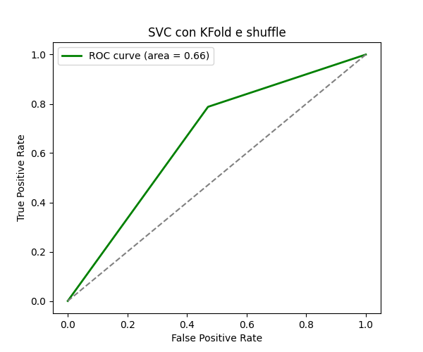

- Precison-Recall

  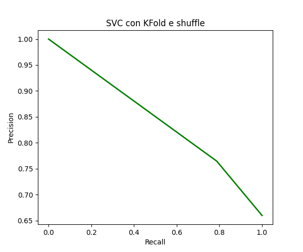

- F1

  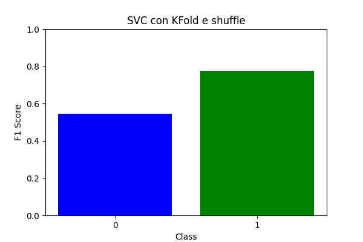

- Accuracy

  `0.7`


## Logistic Regression

Modello di regressione non lineare che predice la probabilità che un’instanza appartenga a una classe. Per migliorare le performance del modello i dati sono stati normalizzati.

I parametri che vogliono essere confrontati sono i seguenti:

```jsx
{
	'penalty': ['l1','l2'],
	'C': [0.001, 0.01, 0.1],
	'solver': ['liblinear'],
	'max_iter': [100000, 150000]
}
```

### Performance

- I parametri migliori trovati sono:

```jsx
{
	'C': 0.1,
	'max_iter': 100000,
	'penalty': 'l2',
	'solver': 'liblinear'
}
```

- Matrice di confusione

  

- ROC

  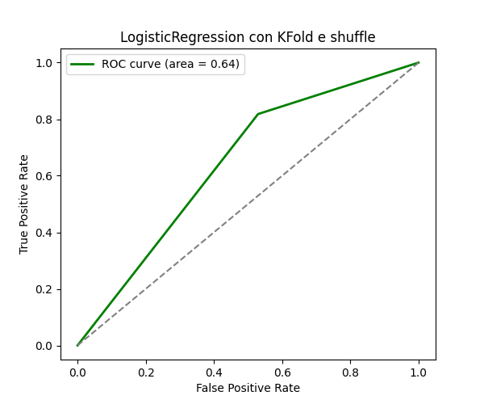

- Precison-Recall

  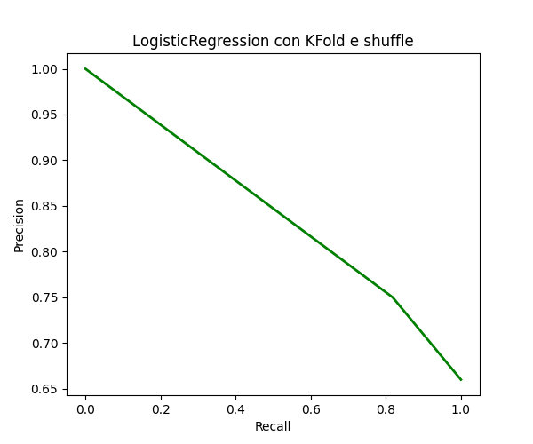

- F1

  

- Accuracy

  `0.7`


## K-NN

Modello che classifica un esempio in base alla vicinanza rispetto ad altri esempi di training considerati. Si considerano i **k elementi più vicini**. Per migliorare le performance del modello i dati sono stati normalizzati.

I parametri che vogliono essere confrontati sono i seguenti:

```jsx
{
	'n_neighbors': [2, 3, 5],
	'weights': ['uniform', 'distance'],
	'algorithm': ["brute"],
	'p': [1, 2, 4]
}
```

### Performance

- I parametri migliori trovati sono:

```jsx
{
	'algorithm': 'brute',
	'n_neighbors': 5, 
	'p': 1, 
	'weights': 'uniform'
}
```

- Matrice di confusione

  

- ROC

  

- Precison-Recall

  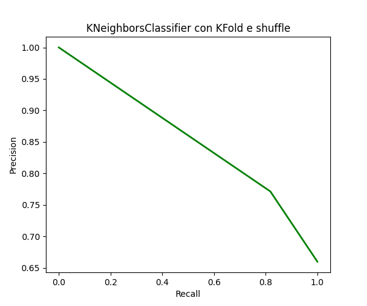

- F1

  

- Accuracy

  `0.72`


## Conclusioni

I modelli non riescono a superare la soglia dello `0.7`, seppur si tratti di un risultato discreto per quanto riguarda feature booleane sono soddisfatto del risultato in quanto non sto considerando tutte le altre informazioni della partita .

In generale i modelli allenati con KF si comportano in maniera migliore rispetto alle loro controparti avendo un accuracy migliore.

I modelli migliori in termini di accuracy sono risultati:

- albero di decisone
- K-NN

entrambi allenati con **KF** e **SHUFFLE**

# 2 - Apprendimento probabilistico

Le **reti bayesiane** sono modelli probabilistici grafici che rappresentano le relazioni di dipendenza condizionata tra variabili tramite un **grafo aciclico diretto**.

Ogni nodo del grafo rappresenta una variabile aleatoria e gli archi indicano le dipendenze probabilistiche tra di esse. Le dipendenze sono descritte tramite **tabelle di probabilità condizionate (CPT)**.

Per questo argomento ho deciso di creare delle reti bayesiane capaci di **simulare il dataset su cui sono state allenate**. In particolare ho prima fatto generare esempi da:

- una rete creata automaticamente
- una rete da me ideata

Le feature continue sono state discretizzate utilizzando il binning cercando di catturare le soglie più importanti:

```python
  data_train = discretize_column(data_train, "3P%", bins=[0.1, 0.2, 0.4, 0.5, 0.6], labels=['Low', 'Medium', 'High', 'Very High'])
  data_train = discretize_column(data_train, "GmSc", bins=[5, 10, 20, 30, 35], labels=['Low', 'Medium', 'High', 'Very High'])
```

## Rete creata automaticamente

La rete creata automaticamente prende in considerazione:

- l’intero dataset
- l’algoritmo di **HillClimb**

  algoritmo di ottimizzazione iterativo che cerca di trovare la soluzione migliore (massimo o minimo) di una funzione obiettivo

- funzione obbiettivo **K2Score**

  metrica utilizzata per valutare la rete bayesiana che studia le probabilità condizionate presenti nella rete bayesiana. Tale funzione va massimizzata proprio dall’algoritmo HillClimb


Modello generato automaticamente con algoritmo HillClimb, score K2 e con un massimo di nodi entranti pari a 2 per semplificare la rete.

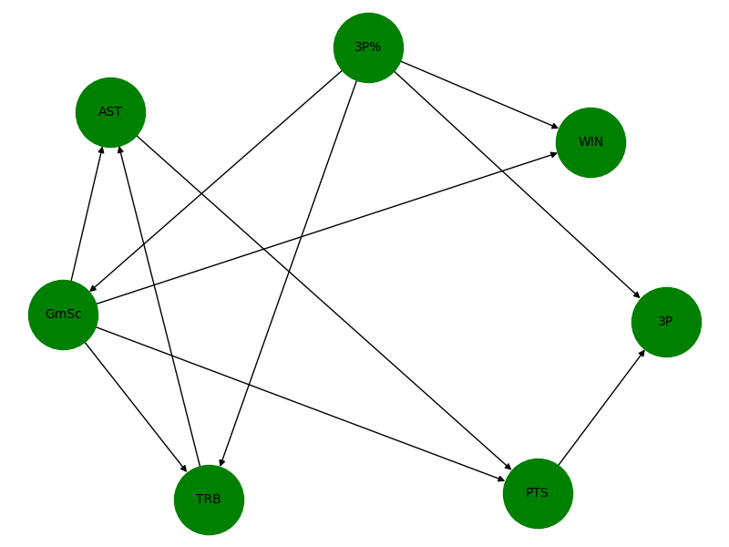

### Esempi generati

```python
     AST        3P%  3P  WIN  TRB       GmSc  PTS
0    10        Low   1    1   13     Medium   18
1     1  Very High   9    0    8     Medium   24
2     7     Medium   3    1   15       High   35
3     4     Medium   3    0    6        Low   19
4     0       High   1    0    5     Medium   18
5     9       High   4    0    9       High   27
6     8       High   4    1    7       High   30
7     8     Medium   2    1    4     Medium   27
8    10     Medium   2    0   14       High   30
9     6     Medium   2    1    6     Medium   27
10   10       High   7    1    6  Very High   40
11   10  Very High   6    1    9       High   34
12    7     Medium   1    1    3     Medium   26
13    8       High   4    1   15  Very High   39
14    9       High   5    1    9  Very High   38
15    7       High   4    0   15       High   27
16    4        Low   1    0    8       High   31
17    9     Medium   2    0    9       High   26
18    5        Low   1    1    9        Low   21
19    8       High   4    1   12       High   26

```

Gli esempi generati riescono parzialmente a comprendere la dipenza fra `GmSc` e le altre feature. Anche quando abbiamo `WIN=1` abbiamo valori contrastanti fra loro. La difficoltà potrebbe essere anche legata alla complessità della rete o ai pochi esempi forniti.

## Rete ideata da me

Ho definito una rete bayesiana definita in questo modo:

```python
  bayesian_model = BayesianNetwork([
      ("3P%", "GmSc"),
      ("AST", "GmSc"),
      ("PTS", "GmSc"),
      ("TRB", "GmSc"),
      ("3P", "WIN"),
      ("3P%", "WIN"),
      ("AST", "WIN"),
      ("GmSc", "WIN"),
      ("PTS", "WIN"),
      ("TRB", "WIN")
  ])
```

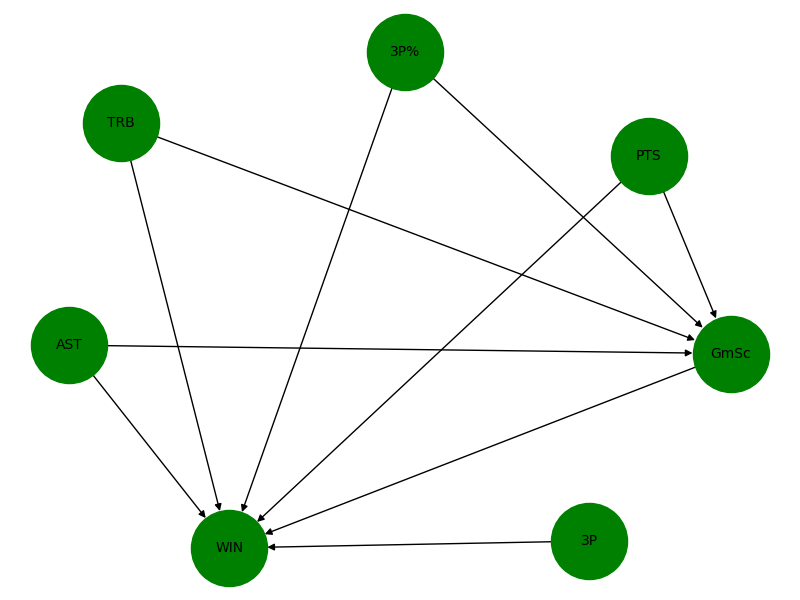

Ho Cercato di mantenere intatto il rapporto fra `GmSc` e le altre feature e di far dipendere la `WIN` da tutte le altre feature che sono considerate quindi di “input”. È un modello molto più semplice rispetto a quello generato dall’algoritmo HillClimb.

### Esempi generati

```python
     3P       GmSc  TRB  AST  PTS  WIN        3P%
0    3       High    7    2   37    0        Low
1    4        Low   12   10   29    0     Medium
2    2  Very High   12    8   40    0       High
3    3        Low    6    7   60    1     Medium
4    5  Very High    9    9   33    0     Medium
5    0       High    6   16   29    1        Low
6    4  Very High    3   10   25    1  Very High
7    3  Very High    5    7   60    1     Medium
8    2        Low    4   15   25    1       High
9    0  Very High    8    9   42    1       High
10   3     Medium   12    7   33    1     Medium
11   2        Low    8    9   42    0       High
12   4     Medium    1    4   32    1        Low
13   3        Low    4    5   31    1     Medium
14   2       High   13    7   35    0     Medium
15   2     Medium    8   10   33    0       High
16   1       High   15    9   25    1        Low
17   2     Medium   11    7   35    1     Medium
18   0        Low    5   13   24    1       High
19   3     Medium    4   11   21    0     Medium
```

Riesce a predirre soprattutto in presenza di una prestazione eclettica una vittoria.

Ovviamente anche in altri esempi pur avendo delle statistiche che indicano una buona partita non riesce a generare un valore per `WIN` coerente.

# 3 - Rete neurale

Le **Feedforward Neural Network** sono un tipo di rete neurale artificiale in cui l'informazione fluisce dai nodi di **input** a quelli di **output**. Sono composte da uno o più **strati nascosti**, dove ogni neurone applica una funzione di attivazione per modellare relazioni complesse tra i dati. L'addestramento avviene tramite **backpropagation** e l'ottimizzazione dei pesi con algoritmi come la **discesa del gradiente**.

In questo caso è stata creata una rete neurale allenata sui dati di training e capace di predirre il risultato della feature `WIN`.

Ho utilizzato una rete con 2 hidden layers :

- **Layer di input**: 6 nodi per le 6 feature di input con funzione di attivazione `leaky_relu`, simile alla relu ma accetta un parametro per evitare la creazione di nodi morti:

  $$
  leaky \_ relu(x, \alpha) = max(x, \alpha \times x)
  $$

- **I Hidden layer**, 4 nodi con funzione di attivazione `swish` definita come:

  $$
  swish(x) = \dfrac{x}{1 + e^{-x}} \ oppure \ sigmoid(x)*x
  $$

- **II Hidden layer**, 3 nodi con funzione di attivazione `sigmoid` :

  $$
  sigmoid(x)=\dfrac{1}{1+e^{-x}}
  $$

- **Layer di output**, un nodo per la feature target

In maniera grafica la rete ha la seguente forma

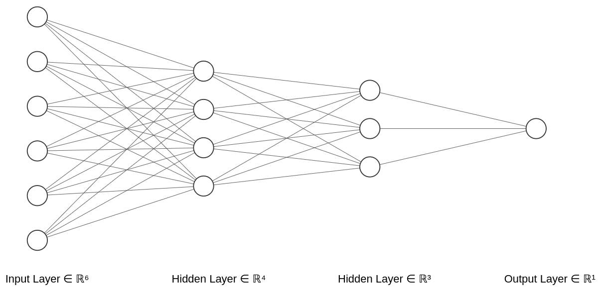

Il dataset è stato normalizzato prima di essere utilizzato.

Nella backpropagation:

- Ho utilizzato la **full-batch gradient descent** nella backpropagation vista la dimensione del training set.
- Ho impostato un learning rate pari a $0.002$
- Le “epoche” utilizzate sono $50000$
- Ho implementato un sistema di `dropout` per “spegnere” alcuni nodi del primo hidden layer durante il backtracking, dovrebbe aiutare a evitare il sovradattamento del modello. Attraverso la variabile `dropout_rate` è possibile regolare la probabilità che ciò accada.
- L’algoritmo per il backtracking si blocca se si è raggiunto un errore accettabile o se il distacco fra l’errore attuare e il precedente è minore di un determinato $\delta$ e si sono già effettuate la metà delle epoche

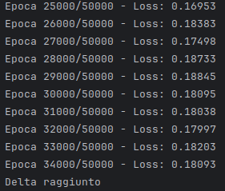

La valutazione della rete è stata effettuata con l’`average log loss` andando a calcolare le predizioni per tutti gli esempi del testing set.

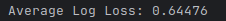

# 4 - Knowledge Graph

I **Knowledge Graph** sono strutture di dati che rappresentano informazioni in modo semantico attraverso nodi e relazioni, permettendo una comprensione avanzata delle connessioni tra concetti. In questo grafo:

- Ogni nodo rappresenta **un'entità** (oggetto o valore)
- Ogni arco rappresentano le **relazioni** fra entità

In questo caso ho realizzato un knowledge graph che rappresenta in maniera generica delle partite di **NBA** con le relative statistiche per ogni giocatore. Avendo a disposizione solamente le statistiche di Doncic per ora ci saranno solamente le sue.

Un esempio di partita rappresentato nel grafo è il seguente:

```python
@prefix ns1: <http://icon-uniba.uni/exam/> .
@prefix xsd: <http://www.w3.org/2001/XMLSchema#> .

<http://icon-uniba.uni/exam/games/0> ns1:gioca_in_casa <http://icon-uniba.uni/exam/teams/WAS> ;
    ns1:gioca_in_trasferta <http://icon-uniba.uni/exam/teams/DLS> ;
    ns1:giocata_il "2019-10-23" ;
    ns1:ha <http://icon-uniba.uni/exam/stats/0/1> ;
    ns1:vinta_da <http://icon-uniba.uni/exam/teams/DLS> .

<http://icon-uniba.uni/exam/stats/0/1> ns1:GmSc 2.43e+01 ;
    ns1:assists 3 ;
    ns1:bloks 0 ;
    ns1:defensive_rebounds 8 ;
    ns1:del_team <http://icon-uniba.uni/exam/teams/DLS> ;
    ns1:difference 0 ;
    ns1:field_goals 12 ;
    ns1:field_goals_avg 19 ;
    ns1:field_goals_perc 6.32e-01 ;
    ns1:free_throws 6 ;
    ns1:free_throws_avg 8 ;
    ns1:free_throws_perc 7.5e-01 ;
    ns1:giocatore <http://icon-uniba.uni/exam/players/Luka_Doncic> ;
    ns1:offensive_rebounds 1 ;
    ns1:personal_fouls 4 ;
    ns1:points 34 ;
    ns1:steals 2 ;
    ns1:total_rebounds 9 ;
    ns1:tree_points 4 ;
    ns1:tree_points_avg 9 ;
    ns1:tree_points_perc 4.44e-01 ;
    ns1:turnover 6 .
```

- Ogni partita ha un suo **URI**
  - Per ogni partita si hanno le due squadre che si sono affrontate, la data e il vincitore
- Ogni team ha un suo **URI**
- Ogni giocatore ha un suo **URI**
- Ogni statistica relativa ad un giocatore di una partita ha un suo **URI**
  - Ogni statistica ha le informazioni sulle performance del giocatore

Per ogni esempio è sono quindi state generate le triple mostrate qui sopra.

Il KG generato è nella cartella `documents/knowledge_graph`.

## Query

Una volta creato il **KG** ho creato delle query in **SPARQL** parametrizzate che accettano i valori dati come argomenti durante l’esecuzione dello script.

La documentazione per eseguire le query è nel file [README.md](README.md) nella sezione del Knowledge Graph.

Le query create sono le seguenti:

### Partite precedenti

Fornendo il codice di due squadre (ad esempio DLS e PHO), la query ricava tutti i match fra le due.

```python
f"""
    PREFIX ns: <http://icon-uniba.uni/exam/>

    SELECT ?game ?home_team ?away_team
    WHERE {{
        ?game ns:gioca_in_casa ?home_team .
        ?game ns:gioca_in_trasferta ?away_team .
        FILTER((?home_team = <http://icon-uniba.uni/exam/teams/{team_b}> && ?away_team = <http://icon-uniba.uni/exam/teams/{team_a}>) || 
               (?home_team = <http://icon-uniba.uni/exam/teams/{team_a}> && ?away_team = <http://icon-uniba.uni/exam/teams/{team_b}>))
    }}
"""
```

### Statistiche di un giocatore in una partita

Fornendo il nome di un giocatore e il codice di una partita, la query ricava le statistiche del giocatore per quella partita.

```python
f"""
    PREFIX ns: <http://icon-uniba.uni/exam/>
    
    SELECT ?game ?player ?team ?points ?assists ?rebounds
    WHERE {{
        ?game ns:ha ?stat .
        ?stat ns:giocatore ?player .
        ?stat ns:points ?points .
        ?stat ns:del_team ?team .
        ?stat ns:assists ?assists .
        ?stat ns:total_rebounds ?rebounds .
        FILTER (?player = <http://icon-uniba.uni/exam/players/{player}> && ?game = <http://icon-uniba.uni/exam/games/{game}>)
    }}
"""
```

### Partite vinte

Fornendo il codice di una squadra, la query ricava tutte le partite vinte da essa.

```python
f"""
  PREFIX ns: <http://icon-uniba.uni/exam/>

  SELECT ?game ?date ?home_team ?away_team
  WHERE {{
      ?game ns:vinta_da <http://icon-uniba.uni/exam/teams/{team}> .
      ?game ns:gioca_in_casa ?home_team .
      ?game ns:gioca_in_trasferta ?away_team .
      ?game ns:giocata_il ?date .
  }}
"""
```

### Partite effettuate in un giorno

Fornendouna data, la query ricava tutte le partite effettuate in quella data.

```python
f"""
  PREFIX ns: <http://icon-uniba.uni/exam/>

  SELECT ?game ?date ?home_team ?away_team
  WHERE {{
      ?game ns:gioca_in_casa ?home_team .
      ?game ns:gioca_in_trasferta ?away_team .
      ?game ns:giocata_il ?date .
      FILTER(?date = "{date}")
  }}
"""
```

### Partite in cui un giocatore ha effettuato una tripla doppia

Un giocatore effettua una *tripla doppia* quando nella stessa partita effettua 10 o più punti, rimbalzi e assist.

La query, dato un giocatore restituisce le partite in cui esso ha effettuato una tripla doppia.

```python
f"""
  PREFIX ns: <http://icon-uniba.uni/exam/>
  
  SELECT ?game ?date ?home_team ?away_team ?player ?team ?points ?assists ?rebounds
  WHERE {{
      ?game ns:giocata_il ?date .
      ?game ns:ha ?stat .
      ?stat ns:giocatore ?player .
      ?game ns:gioca_in_casa ?home_team .
      ?game ns:gioca_in_trasferta ?away_team .
      ?stat ns:del_team ?team .
      ?stat ns:points ?points .
      ?stat ns:assists ?assists .
      ?stat ns:total_rebounds ?rebounds .
      FILTER (
          ?player = <http://icon-uniba.uni/exam/players/{player}> && 
          ?points >= 10 && 
          ?assists >= 10 && 
          ?rebounds >= 10
      )
  }}
"""
```

### Punti medi durante un intervallo di tempo

Dato un range temporale e un giocatore, la query restituisce la sua media punti durante quel periodo.

```python
f"""
  PREFIX ns: <http://icon-uniba.uni/exam/>
  
  SELECT ?game ?date ?home_team ?away_team ?player ?points ?assists ?rebounds
  WHERE {{
      ?game ns:giocata_il ?date .
      ?game ns:ha ?stat .
      ?stat ns:giocatore ?player .
      ?game ns:gioca_in_casa ?home_team .
      ?game ns:gioca_in_trasferta ?away_team .
      ?stat ns:points ?points .
      ?stat ns:assists ?assists .
      ?stat ns:total_rebounds ?rebounds .
      FILTER (
          ?player = <http://icon-uniba.uni/exam/players/{player}> && 
          ?points >= 10 && 
          ?assists >= 10 && 
          ?rebounds >= 10
      )
  }}
"""
```

## Conclusioni

Con le singole informazioni a disposizione il grafo può permetterci di effettuare query importanti. Il completamento dello stesso con le statistiche di altre partite amplierebbe di molto la quantità di conoscenza che potremmo estrarre dal grafo.